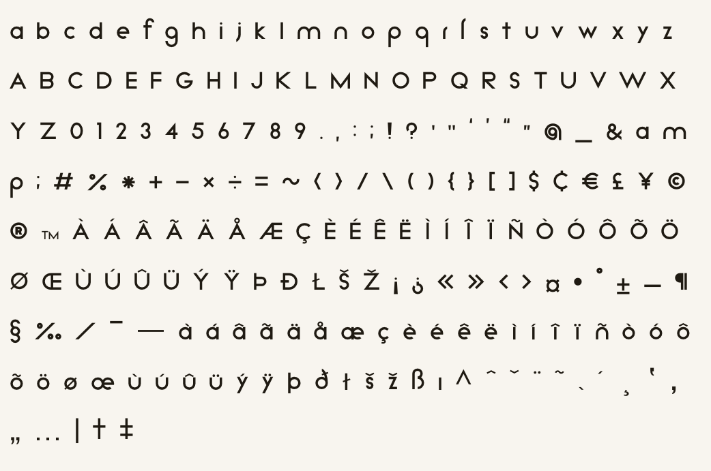

# [Kunika](https://kurogedelic.github.io/Kunika/)
Kunika is Neo-Geometric font.

# [Demo Page](https://kurogedelic.github.io/Kunika/)

```json
**Important: Kunika is Alpha Version**
```

Recommended to use for Heading and Logo designs.



## Family
+ Regular
+ Light

## ToDo
+ **Fix Font Size**
+ **Fix Kerning**
+ Add Slash Zero
+ Add Italic
+ Add Tabular/Alternative Numeric Set
+ Add et ls Th TT tt fl fj fh fk ft ſl ſſ ſß ligatures
+ Add 

+ Add Cyrillic set
+ Add Greek set

+ Support Variables FONT
+ Add Katakana / Hiragana set

## Source
Kunika made in FontForge.
You can edit `.sfd` files.


## License
Kunika is under OTF 1.1.


## Impressions
Made by Leo Kuroshita.
Made with FontForge.
